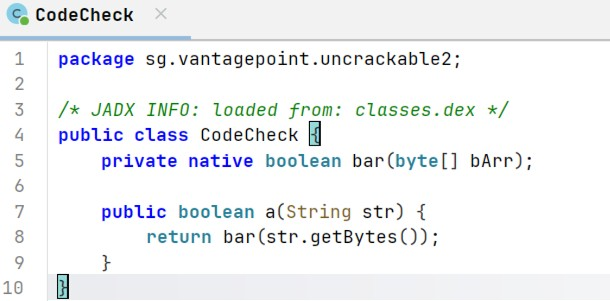
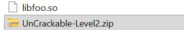
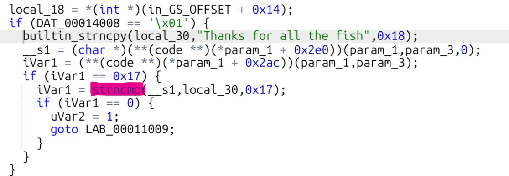
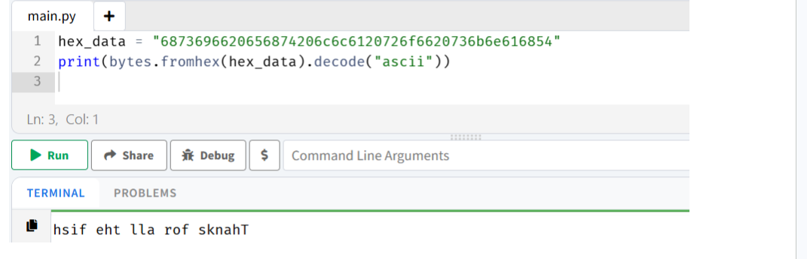
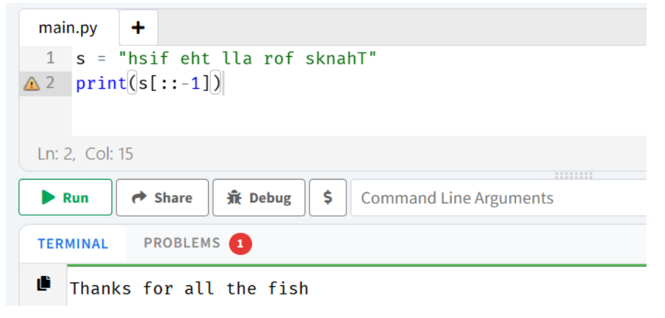
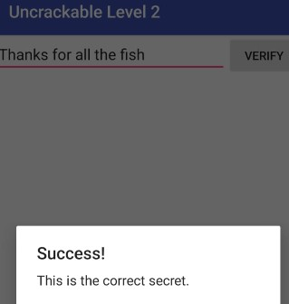

#  Lab 5 — UnCrackable Level 2

##  C'est quoi le but ?

Dans ce lab, j'avais une application Android et je devais trouver le mot secret caché dedans. L'application ne donnait aucun indice, donc j'ai dû analyser son code pour comprendre comment elle vérifie le mot de passe.

---

##  Ce que j'ai utilisé

- **JADX** → pour lire le code Java de l'APK
- **Ghidra** → pour analyser le code natif en C
- **Python** → pour décoder et retrouver le secret

---

##  Ce que j'ai fait

### 1. J'ai ouvert l'APK avec JADX

La première chose que j'ai faite c'est regarder le code Java. J'ai trouvé la classe `CodeCheck` mais elle ne contenait pas vraiment la logique de vérification. J'ai vu cette ligne :

```java
System.loadLibrary("foo")
```

Ça m'a indiqué que la vraie vérification se passe dans une bibliothèque native `libfoo.so`, pas dans le Java.



---

### 2. J'ai extrait le fichier libfoo.so

J'ai décompressé l'APK comme un fichier ZIP et j'ai navigué dans `lib/x86/` pour récupérer `libfoo.so`. C'est ce fichier qui contient le secret.



---

### 3. J'ai analysé libfoo.so

J'ai chargé le fichier et cherché la fonction responsable de la vérification. Dans le code décompilé, j'ai repéré un `strncmp` — c'est lui qui compare ce que l'utilisateur tape avec le vrai secret stocké en mémoire.



---

### 4. J'ai décodé le secret en Python

Les données étaient en hexadécimal, donc j'ai utilisé Python pour les convertir en texte :

```python
hex_data = "687369660eht6120726f6620736b6e616854"
print(bytes.fromhex(hex_data).decode("ascii"))
```

Résultat obtenu :
```
hsif eht lla rof sknahT
```



---

### 5. J'ai inversé la chaîne

Le texte était stocké à l'envers (Little-Endian), donc j'ai juste inversé la chaîne :

```python
s = "hsif eht lla rof sknahT"
print(s[::-1])
```

Et j'ai obtenu :
```
Thanks for all the fish
```



---

### 6. J'ai validé dans l'application

J'ai entré `Thanks for all the fish` dans l'app et... **ça a marché !** 🎉



---

## Flag trouvé

```
Thanks for all the fish
```

---

## 💡 Ce que j'ai appris

Ce lab m'a montré que la sécurité ne se limite pas au code Java visible — les bibliothèques natives en C peuvent cacher des informations importantes. Il faut savoir utiliser des outils comme Ghidra pour aller plus loin dans l'analyse.
